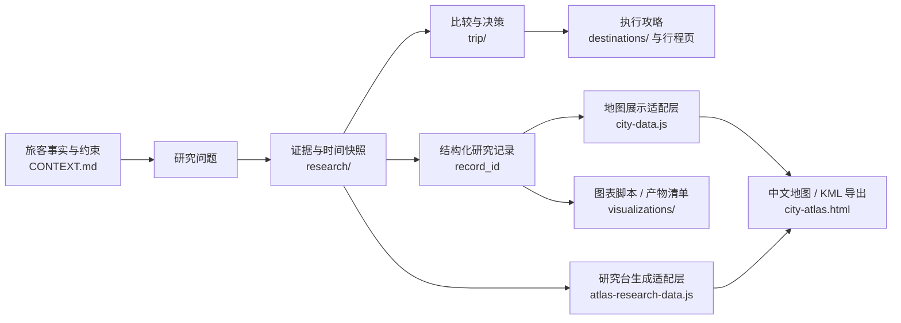

# 西班牙行程资料目录

以本页作为入口。当前资料分为行程决策、分类研究、城市指南和原始研究记录；价格、开放时间、班次和政策均需按标注日期复核。

更新时间：2026-09-29 HKT

## 当前进度

> 2026-09-27 复核补充：路线结构与主推人像机位均按至少 3 个不同小红书笔记交叉；餐厅按“核对日前 1 年内至少 1 篇可用的 Safari 详情帖”即可进入现场卡，有多篇时再交叉，仍不把体验帖当作当前营业、价格或必吃保证。新增[每日机位·车站·餐厅·超市现场执行卡](trip/daily-field-cards.md)，把 D0–D9 拆成每日多点拍摄、车站/列车记录、至少一顿正餐、备用正餐和住宿附近早餐采购；本轮再用小红书补充[超市伴手礼、特色零食与面包清单](research/xhs/supermarket-snacks.md)，区分可装箱干货、当天吃的冷藏食品，以及喷雾油/酒/肉类携带风险。建筑空镜从人像参考中排除，落日/晚霞/天际线/食物保留为独立视觉素材；圣家堂穿着、摄影器材、食物饮料和静默时段已与官方规则对齐。详见[推荐交叉审计](research/xhs/recommendation-cross-check.md)和[本次全面审查](research/trip-audit-2026-09-27.md)。

> **天数与航班基准（2026-09-27）：**往返日期已锁定：1/25 20:20 HKG→PEK→MAD，Trip.com 当前国航候选在 1/26 07:25 到达 Madrid；2/3 12:20 MAD→PEK，香港旅客再乘次日 09:25 PEK→HKG 13:05；三人统一往返票当前公开价 HKD 7,130/人、去回程各 23 kg，继续等降价。该日期对应西班牙当地固定 8 晚 `Barcelona 3 + Granada 2 + Seville 2 + Madrid 1`；若最终到达时刻变化，只重新判断固定日期内的衔接和可删模块，不自动顺延城市。住宿、车票和门票按这组日期重查，任何加夜数需另行确认。

> **机票研究同步（2026-09-27 15:18 HKT）：**新增 `AFS-LIVE-20260927-026`。Trip.com 公开页筛选中国国航并选择 1/25 20:20→1/26 07:25 去程、2/3 12:20→2/4 13:05 经 PEK 返程，显示三人总价 HKD 21,390、每人 HKD 7,130、去回程各 23 kg；北京两位旅客的 PEK 甩尾仍是条件方案，未确认承运人放行行李或末段不乘后果。

> **时长审计（2026-09-27）：**当前固定主计划为 8 晚 `3+2+2+1`，Barcelona 有两个完整日，Granada 和 Seville 各有一个完整主轴日，足够三城核心主线但不足以完成小红书攻略中的全部点位。覆盖不足按“圣家堂、Alhambra、Alcázar、Cathedral、老城/广场”优先级删减，不以暴走或加夜数补点；任何 9/10 晚版本需用户另行确认。

> **转场日执行规则（2026-09-27）：**城市间通勤日不再按“整天放弃”处理：先保证正常抵达、入住/寄存和补给，再视实际时间安排 60–120 分钟平地 citywalk、晚霞和附近晚餐；Sagrada、Alhambra、Alcázar 等正式预约仍放在完整日。四城日落与一月底历史气候见[研究卡](research/city-weather-sun.md)，雨天、延误或体力不足时整段可删。

> **执行版修复（2026-09-29）：**D1 已改为“预计落地到计划发车至少约 5 小时、车票可改退、行李/航站楼已确认”才当天去 Barcelona，否则 Madrid 机场过夜；D5 将 Nasrid 设为硬核心、其余园区只选一个；D7 将 Alcázar 和 Cathedral 设为建筑核心，Giralda 登塔与 Santa Cruz 可删；D8 已明确为交通日并从地图主路线删除可选 Plaza de España。根目录 `plan.geo.json` 已重新运行路线、日落和地图链接检查，网页数据已从该 canonical 文件同步并通过运行时/站点测试；机票、住宿、车票和门票仍未购买。

| 领域 | 当前状态 | 主记录 |
|---|---|---|
| 行程 | 已确认“Madrid入境 → Barcelona → Granada → Seville → 2/2 Madrid机场—市区交通走廊过夜 → 2/3国航返程”；往返日期固定、8晚 `3+2+2+1`，覆盖不足按核心景点优先级删减，不自动平移或增加夜数；D1 增加 5 小时硬衔接门，D5/D7 改为核心＋可删区域，D8 标为交通日并删除可选 Plaza 地图点；小时级攻略继续按先行李/入住/休息再 citywalk 执行；Barcelona D3 改为 Gothic/Born＋Passeig外观，Casa Batlló仅作为含音频的单一付费分支，La Pedrera/Park Güell不叠加；网页餐厅卡已按具体日期和餐段绑定：总览最多显示午餐、晚餐各一家，进入步骤后只在对应餐段显示，不再把同一餐厅重复到每个步骤；餐厅卡继续显示菜品外观、三人点法、预算样本、小红书图片和当天复核入口；移动端数据已从 canonical 同步并通过运行时、语法和站点测试；GitHub Pages 已配置为推送 `main` 后自动同步、检查和发布 | [共享事实](CONTEXT.md)、[每日现场执行卡](trip/daily-field-cards.md)、[小时级执行版](trip/hourly-guide.md)、[餐厅现场卡](trip/restaurant-cards.md)、[人像机位卡](trip/photo-pose-cards.md)、[路线框架](trip/itinerary.md)、[手机 UI 预览](trip-guide-ui/)、[vivo Chrome 网页版](trip-guide-ui/site/)、[行前清单数据](trip-guide-ui/public/pre-departure.json)、[托管说明](trip-guide-ui/site/README.md)、[预算与冲突](trip/budget-and-conflicts.md) |
| 机票 | 2026-09-27 当前首选监测票为三人统一 HKG–PEK–MAD / MAD–PEK–HKG：Trip.com 总计 HKD 21,390（每人 HKD 7,130），去回程各显示 23 kg；北京两位返程计划 PEK 甩尾，当前仍比 HKD 5,000/人上限高 HKD 2,130，等降价，不是已出票 | [机票比较](trip/flights.md)、[特价结构研究](research/flights/fare-patterns.md)、[票价快照表](research/flights/fare-snapshots.csv)、[工具排序](research/tools-and-sources.md) |
| 住宿 | 已完成每城 Top 3：酒店均在 Trip.com 与携程同条件核对并取较低价，民宿只用 Airbnb；超 CNY 1,500/晚全部排除。Barcelona 已基本锁定 Airbnb `1659522`（整套、露台、独立厨房/卫生间，尚未预订）；Granada 优先 Gamboa 等含早餐酒店；Seville Hotel Giralda Center 已由旅客确认可行；Madrid 返程前一晚当前以 Hotel Maydrit Airport 作为机场—市区交通走廊的性价比候选，尚未预订。 | [住宿比较](trip/accommodation.md)、[房价快照表](research/accommodation/rate-snapshots.csv) |
| 签证 | 申请地点计划为北京两人、香港一人；香港领区资格待核实 | [签证与入境](trip/visa-and-entry.md) |
| 景点 | Alhambra、Sagrada Família、Seville Alcázar 需按日期复核预约；尚无已购门票记录 | [景点与门票](trip/attractions-and-tickets.md) |
| 小红书研究 | 三城主配额已完整阅读 180/180 篇，另有 2 篇部分阅读；新增 1–2 月冬季专项 18 条城市记录（每城 6 条，不计入主配额）；另完成马德里中转补充 10 篇，并追加 1 条西班牙高铁价格/舒适度交叉验证；2026-09-27 用 Safari 补读圣家堂穿着/拍照合规、5 条超市/伴手礼和 3+3 条签证/行前准备笔记，已分别回写 D2、行李 UI、超市现场卡与签证/行李 checklist；又结合用户既有欧洲经验新增 T-30–T-7 提前采购、到货验收和替代方案时间线；交通、票务、住宿与路线冲突已写回逐篇记录，2027 具体班次/价格/房价/库存仍需定日期后复核；地图研究台现可浏览三城合计 201 条索引 | [研究总索引](research/xhs/README.md)、[签证与行前准备双查](research/xhs/pre-departure-cross-check.md)、[超市伴手礼补充](research/xhs/supermarket-snacks.md)、[马德里中转补充](research/xhs/madrid-transit.md)、[推荐交叉审计](research/xhs/recommendation-cross-check.md) |
| 三城地图 | 在现有中文地图组件上扩展了 16 个本次行程规划点位/路线，并把研究台优化为“资料总览 → 资料工作台 → 详细记录”的工作区：默认先看按用途分组的日程、住宿、餐饮与灵感入口，再进入搜索/分类；当前城市范围会同步更新资料数量与下一步核对事项。每日攻略按“城市 → 日期”组织酒店、景点、交通、餐饮、雨天与晚到删减规则。住宿默认严格排除 CNY 1,500/晚以上和硬条件不合格记录，官方资料与规划候选分层显示 | [地图查看器](research/city-maps/city-atlas.html)、[地图说明](research/city-maps/README.md)、[可编辑计划](plan.geo.json)、[KML](trip.kml)、[日历](gates.ics) |
| 预算与冲突 | 国际机票按用户要求暂不计入当前旅行预算，单独观察当前国航统一往返票降价；住宿组合按 Barcelona `1659522`（3晚）+ Granada Gamboa（2晚）+ Seville Giralda（2晚）+ Madrid 2/2 机场—市区走廊一晚重排；Barcelona 真实日期总价、Giralda最终取消政策/房型和 Madrid 接驳仍需复核。 | [预算与冲突](trip/budget-and-conflicts.md)、[餐饮策略](trip/dining.md) |

## 资料流

## 行程决策

- [共享事实与待决事项](CONTEXT.md)：跨对话使用的唯一事实总表。
- [每日行程与路线框架](trip/itinerary.md)
- [小时级执行攻略](trip/hourly-guide.md)
- [每日机位·车站·餐厅·超市现场执行卡](trip/daily-field-cards.md)
- [餐厅现场抄作业卡](trip/restaurant-cards.md)
- [人像机位与动作卡](trip/photo-pose-cards.md)
- [国际机票](trip/flights.md)
- [住宿](trip/accommodation.md)
- [签证与入境](trip/visa-and-entry.md)
- [景点与门票](trip/attractions-and-tickets.md)
- [城市间交通](trip/ground-transport.md)
- [预算与冲突审查](trip/budget-and-conflicts.md)
- [餐饮策略](trip/dining.md)
- [旅行当天跟随 UI 原型](trip-guide-ui/)
- [vivo Chrome 手机网页/PWA](trip-guide-ui/site/)，底部“出发前”入口含签证流程、北京/香港材料分组和行李 checklist
- [行前清单数据](trip-guide-ui/public/pre-departure.json)
- [网页托管与安装说明](trip-guide-ui/site/README.md)

## 城市指南

- [Barcelona](destinations/barcelona.md)
- [Granada](destinations/granada.md)
- [Seville](destinations/seville.md)

## 研究资料

- [研究记录规范与数据表](research/README.md)
- [机票特价结构研究](research/flights/fare-patterns.md)
- [可视化产物规范](visualizations/README.md)
- [小红书逐条研究总索引](research/xhs/README.md)，含 Barcelona、Granada、Seville 分页、[Madrid 中转补充](research/xhs/madrid-transit.md)、[超市伴手礼/零食/面包补充](research/xhs/supermarket-snacks.md)及[签证与行前准备双查](research/xhs/pre-departure-cross-check.md)
- [路线、餐厅与人像点位交叉审计](research/xhs/recommendation-cross-check.md)
- [四城日落与一月底天气参考](research/city-weather-sun.md)
- [参考图素材清单](research/xhs/assets/pose-references/README.md)：人像机位清单；项目另保留落日/晚霞/天际线和食物，排除纯建筑空镜
- [中文交互地图](research/city-maps/city-atlas.html)与[地图接口规范](research/city-maps/README.md)
- [地图研究台生成脚本](research/city-maps/build-atlas-research-data.py)与[生成数据适配层](research/city-maps/atlas-research-data.js)
- [本次可编辑路线计划](plan.geo.json)、[KML](trip.kml)、[行前检查日历](gates.ics)、[插画版视觉摘要（非执行稿）](trip-illustrated.html)
- [旅行工具与平台调研](research/tools-and-sources.md)
- [原始文档归档说明](research/archive/README.md)

## 资料维护规则

- 把稳定偏好和已确认事实记在 CONTEXT.md；价格、库存、班次和开放时间写入对应分类页并标记查询日期。
- 按 research/README.md 分开记录“证据核验状态”和“方案决策状态”；不要把核实程度与是否选择混成一个状态。
- 搜索结果只是线索。机票、住宿和门票的价格、行李、退改规则及可用性应在供应方页面复核；不要把候选写成已预订。
- 小红书只作路线和拍照灵感；营业、票价、交通、安全和拍摄限制需另行核实。圣家堂的着装、器材、食物饮料和静默时段已改用场馆官方规则作为执行依据。
