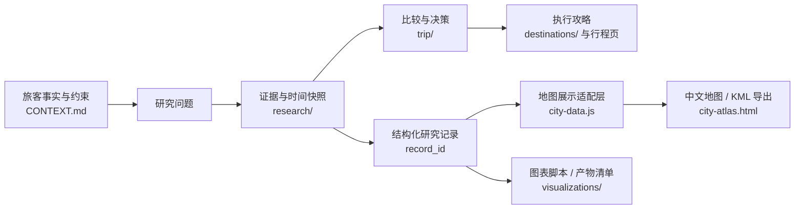

# 西班牙行程资料目录

以本页作为入口。当前资料分为行程决策、分类研究、城市指南和原始研究记录；价格、开放时间、班次和政策均需按标注日期复核。

更新时间：2026-09-25

## 当前进度

| 领域 | 当前状态 | 主记录 |
|---|---|---|
| 行程 | 三城已确定；去程具体日期、集合点、入境机场、城市顺序和住宿晚数待定 | [共享事实](CONTEXT.md)、[路线框架](trip/itinerary.md) |
| 机票 | 2027 年 1 月已有多条 Trip.com 往返搜索记录，显示价均超过预算；部分学生票只显示去程行李。12 月价格仅作日期规律参照，不代表 1 月可买到同价票 | [机票比较](trip/flights.md)、[票价快照表](research/flights/fare-snapshots.csv) |
| 住宿 | 条件已记录；本地资料尚无已核实候选 | [住宿比较](trip/accommodation.md)、[房价快照表](research/accommodation/rate-snapshots.csv) |
| 签证 | 申请地点计划为北京两人、香港一人；香港领区资格待核实 | [签证与入境](trip/visa-and-entry.md) |
| 景点 | Alhambra、Sagrada Família、Seville Alcázar 需按日期复核预约；尚无已购门票记录 | [景点与门票](trip/attractions-and-tickets.md) |
| 小红书研究 | 已完整阅读 2/180 篇；另有 1 篇部分阅读 | [研究总索引](research/xhs/README.md) |
| 三城地图 | 中文地图接口已就绪；当前研究图层为空，地图要素须引用 `record_id` | [地图查看器](research/city-maps/city-atlas.html)、[数据接口](research/city-maps/README.md) |

## 资料流

## 行程决策

- [共享事实与待决事项](CONTEXT.md)：跨对话使用的唯一事实总表。
- [每日行程与路线框架](trip/itinerary.md)
- [国际机票](trip/flights.md)
- [住宿](trip/accommodation.md)
- [签证与入境](trip/visa-and-entry.md)
- [景点与门票](trip/attractions-and-tickets.md)
- [城市间交通](trip/ground-transport.md)

## 城市指南

- [Barcelona](destinations/barcelona.md)
- [Granada](destinations/granada.md)
- [Seville](destinations/seville.md)

## 研究资料

- [研究记录规范与数据表](research/README.md)
- [可视化产物规范](visualizations/README.md)
- [地图目录](research/city-maps/README.md)
- [小红书逐条研究总索引](research/xhs/README.md)，含 Barcelona、Granada、Seville 分页
- [中文交互地图](research/city-maps/city-atlas.html)与[地图接口规范](research/city-maps/README.md)
- [旅行工具与平台调研](research/tools-and-sources.md)
- [原始文档归档说明](research/archive/README.md)

## 资料维护规则

- 把稳定偏好和已确认事实记在 CONTEXT.md；价格、库存、班次和开放时间写入对应分类页并标记查询日期。
- 按 research/README.md 分开记录“证据核验状态”和“方案决策状态”；不要把核实程度与是否选择混成一个状态。
- 搜索结果只是线索。机票、住宿和门票的价格、行李、退改规则及可用性应在供应方页面复核；不要把候选写成已预订。
- 小红书只作路线和拍照灵感；营业、票价、交通、安全和拍摄限制需另行核实。
