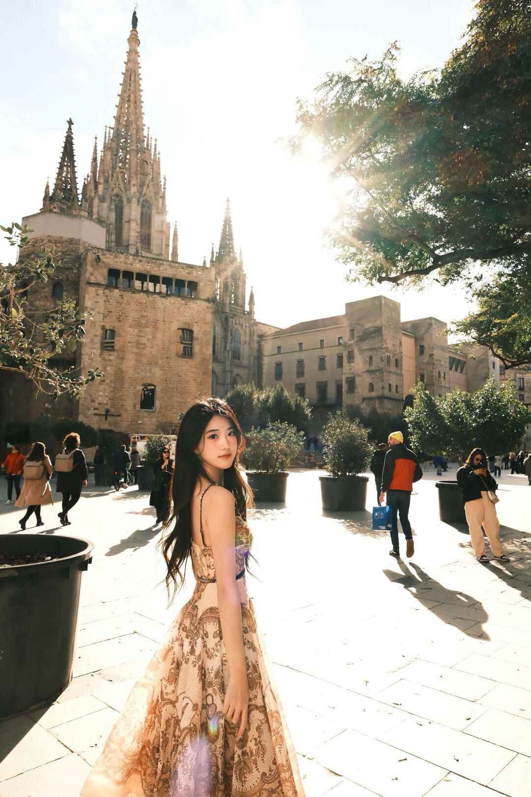
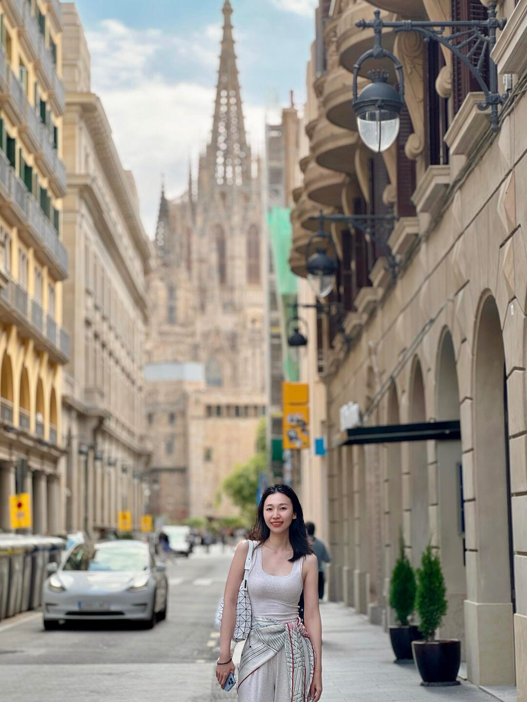
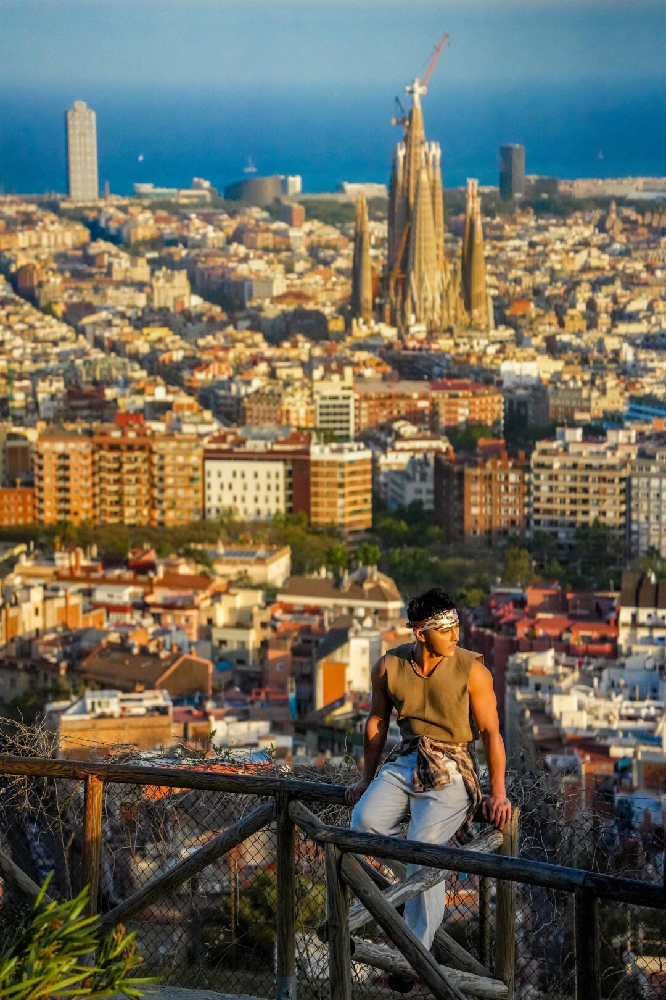
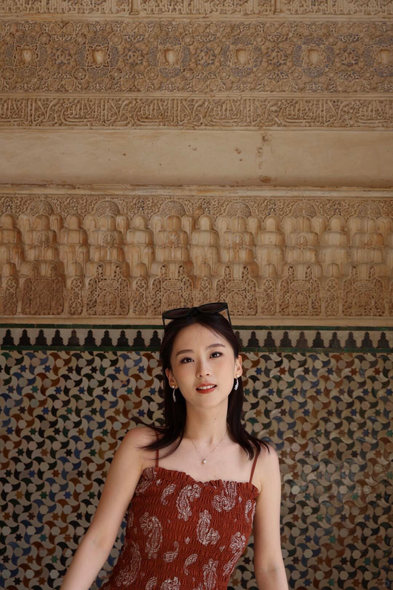
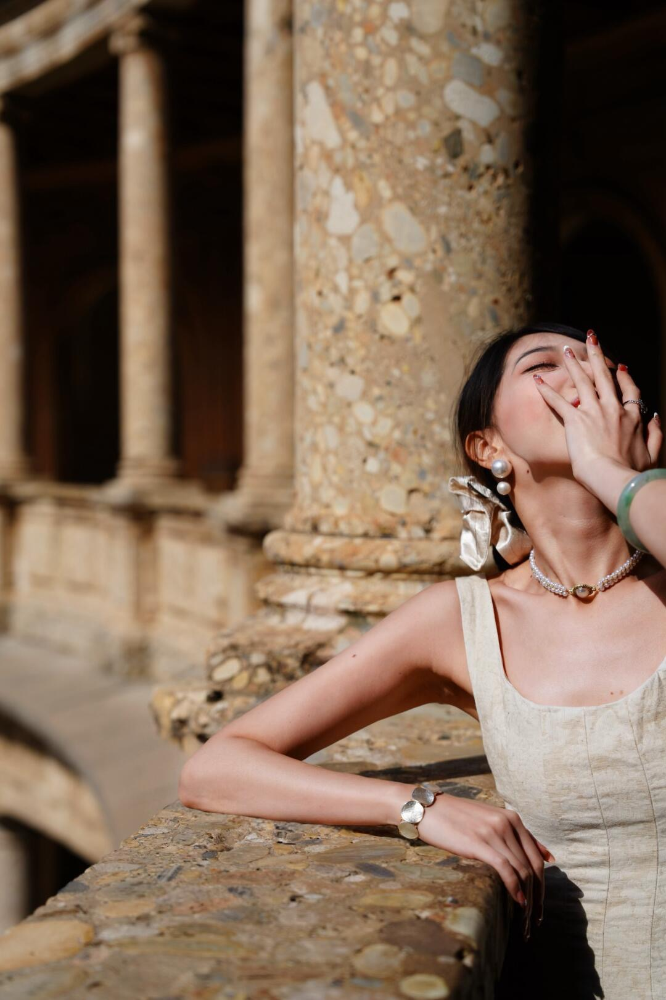
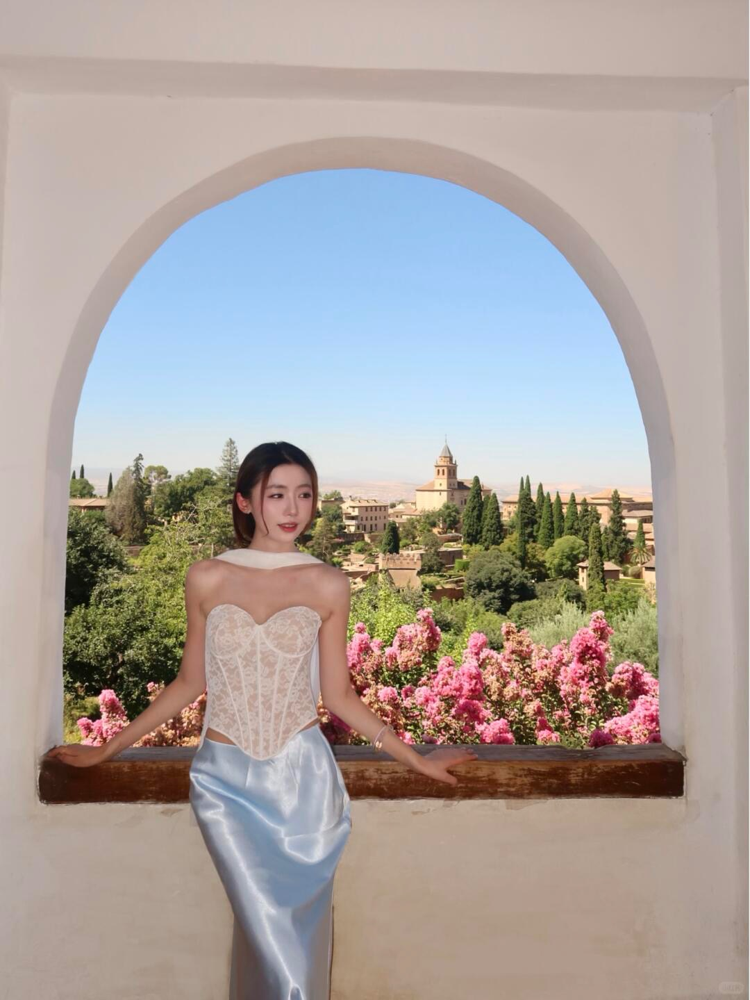
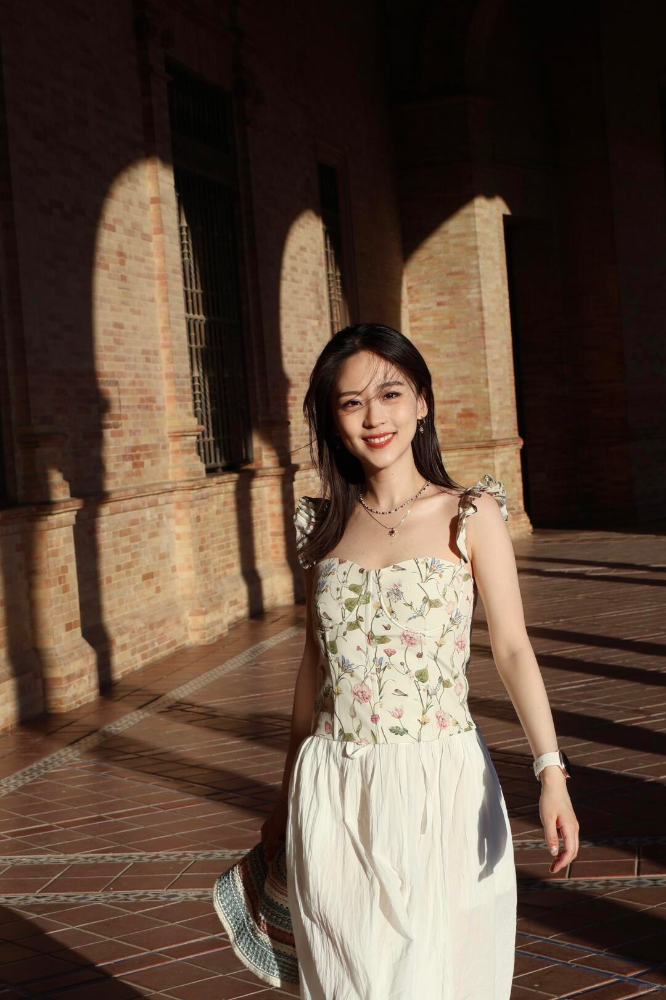
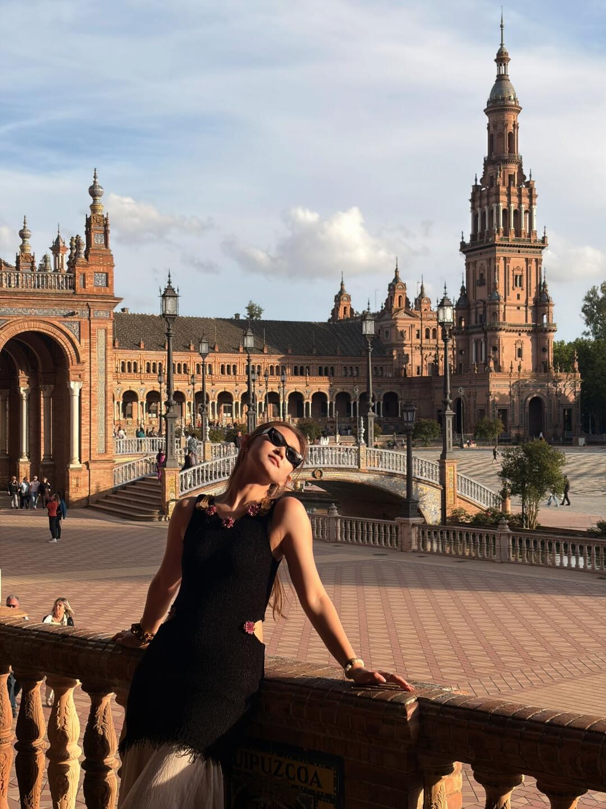
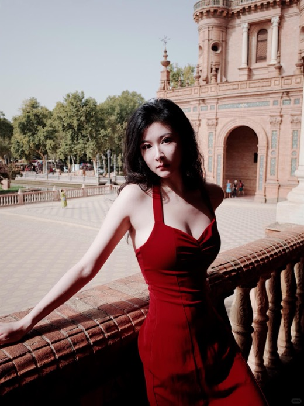

# 人像机位与动作现场卡

最后整理：2026-09-26（Asia/Hong_Kong）。本页只收录“图里有人、可以照着摆动作/构图”的本地参考图；落日、晚霞、天际线和食物图可以作为独立视觉素材保留，但不混入人像机位卡。纯建筑空镜不收录，也不把参考图当作开放时间、门票、拍摄许可或二月花况证据。完整的三帖交叉审计见[小红书推荐交叉审计](../research/xhs/recommendation-cross-check.md)。

本页的通过标准是：每个主推人像组至少有 3 个不同的小红书笔记 ID，并且本地展示图来自这 3 篇不同笔记；同一篇笔记的第二张图只作为动作补充，不能增加帖子计数。小红书图片仅作私人拍摄灵感，实际站位服从工作人员、围栏、游客动线和现场标识。

本轮本地图片统一记录：checked_at_hkt: 2026-09-26T23:22:29+08:00。图片由 Safari 从小红书可见轮播图下载到项目内，仅供本次旅行私人参考，不上传、不重新发布。

## 三人轮拍固定分工

1. A 做模特，B 拍 8–12 张连拍，C 负责看人流和提醒不要挡路；一组完成后顺时针换位。
2. 先拍横构图环境人像，再拍竖构图半身和全身；手机从 1×开始，空间太挤再切 2×，不要一开始用超广角把人物拉变形。
3. 每个点只要三组：正面/侧面、走动/回头、背影/远望。每组 10 秒，拍完立即让出通道。
4. 参考图中的“靠栏杆、坐边缘、探身”只模仿身体方向，不模仿危险站法；双脚留在合法步道内，不跨围栏、不坐文物、不堵门洞。

## Barcelona

### B1｜哥特区/主教堂—城市高机位人像组（3 帖通过）

这是“Barcelona 老城与城市背景人像”组，不把三个不同地点硬说成同一个门洞或同一块地砖。要拍精确的哥特区窄巷时，以现场可站位置为准；第三张更偏 Barcelona 城市高机位，作为同城人像构图补充。

**现场照抄：**

- 第一组让模特背对镜头走 2–3 步，听到快门后只转头和一侧肩膀；第二组改为侧身看远处，手自然搭在外套或包带上。
- 窄巷用 2×拍半身或中景，摄影者站街口/广场边缘；让拱门、墙面或教堂外墙只承担纵深，不要为了塞建筑把人拍得过小。
- 城市高机位优先拍“人看远处”和“侧身回头”，人物放在画面下三分之一，避免模仿任何临边探身动作。
- 哥特区可优先安排上午较早时段；人多、光线硬或通道变窄时，直接换下一个街口，不等待空巷。

| 独立来源帖 | 本地图片 | 交叉得到的可复制内容 |
|---|---|---|
| [69679455000000002203ad5e](https://www.xiaohongshu.com/explore/69679455000000002203ad5e) | 轮播 1 | 走动、回头、侧肩和老城纵深 |
| [69035b8e0000000004012896](https://www.xiaohongshu.com/explore/69035b8e0000000004012896) | 轮播 1 | 哥特区街巷的人像尺度与转身构图 |
| [69f1c63c000000003601dcee](https://www.xiaohongshu.com/explore/69f1c63c000000003601dcee) | 轮播 2 | 城市背景、远望和高机位人像构图 |

补充图 barcelona-69679455000000002203ad5e-02.jpg 来自第一帖，只用于窗边借光动作；不增加“三帖”计数。

### B2｜Barcelona 其他点位怎么处理

Sagrada–Plaça de Gaudí、Avinguda Gaudí、Sant Pau、Passeig de Gràcia、Arc de Triomf、Ciutadella、Bunkers、Tibidabo 和 Montjuïc 仍可作为路线或风景拍摄模块，但本轮没有把它们写成“通过三帖的人像主推点”。现场只在有安全、合法、不挡路的位置拍；不要用建筑空镜补足人像证据。

**Sagrada 专项合规提醒（2026-09-27 复核）：**小红书补充帖 [69f9ae07000000002301445f](https://www.xiaohongshu.com/explore/69f9ae07000000002301445f) 与既有圣家堂外景/光线笔记共同提示，入场前先检查肩膀覆盖、衣物不透明、裤/裙长度；三脚架、自拍杆和专业摄影器材不要作为室内拍摄方案，手机个人记录服从现场检查。官方还规定三脚架和未经授权的商业/宣传拍摄受限，馆内食物饮料不允许带入；这类规则以[Sagrada Família 官方规则](https://sagradafamilia.org/en/rules-and-regulations)为准。该补充不构成新的三帖人像组，也不把小红书室内照片作为可复刻机位。

## Granada

### G1｜Alhambra / Generalife 人像组（3 帖通过）

三篇笔记都提供了带人的 Alhambra/Generalife 构图，但室内纹样、窗景、花园步道不是同一个精确机位。因此照抄动作和画面关系，不照抄站位；宫殿内拍摄限制、停留时间和开放区域以当天工作人员为准。

**现场照抄：**

- 纹样墙/柱廊：人物站在背景前，肩膀略偏向一侧，手放腰侧或轻捏外套边缘；先拍看镜头，再拍看墙面。
- 窗景：人物与窗户成约 45°，脸转向光源；拍一组看窗外、一组轻扶头发，不把身体压到窗沿。
- 花园/步道：沿合法步道走，摄影者喊“回头”后只转头和上半身；不要站到绿篱、花坛或水边边缘。
- 复杂纹样背景用纯色、低纹理服装更容易分离人物；这是审美建议，不是天气结论。

| 独立来源帖 | 本地图片 | 交叉得到的可复制内容 |
|---|---|---|
| [6a032e9c0000000038021d4b](https://www.xiaohongshu.com/explore/6a032e9c0000000038021d4b) | 轮播 1 | 纹样墙/柱廊前的正面半身和几何背景 |
| [68de4ccd0000000007009706](https://www.xiaohongshu.com/explore/68de4ccd0000000007009706) | 轮播 1 | Alhambra 建筑框景中的站姿与人物比例 |
| [6a8a70f70000000033022bfd](https://www.xiaohongshu.com/explore/6a8a70f70000000033022bfd) | 轮播 1 | Generalife 窗景、侧身借光和远景层次 |

补充图 granada-6a032e9c0000000038021d4b-02.jpg 来自第一帖，用于步道走动口令；不增加“三帖”计数。

### G2｜Granada 其他点位怎么处理

Paseo de los Tristes、Carrera del Darro、San Nicolás、Huerto del Carlos 和 San Miguel Alto 可以保留为风景/落日/天际线模块；本轮没有把它们写成通过三帖的人像主推点。山坡、石板路、夜间返程和观景台边缘优先服从安全与当天交通，不为复刻照片站到坡边。

## Seville

### S1｜Plaza de España 人像组（3 帖通过）

三篇独立笔记都把西班牙广场的拱廊、桥面或二层平台与人物结合，但角度和光线不同。以“同一景区的三帖交叉”通过，不把某一篇的具体平台、光线或人流当作 2027 保证。

**现场照抄：**

- 拱廊阴影侧：人物先正面看镜头，再从阴影走 2–3 步进入光线边缘；走动、低头、抬头各拍一组。
- 桥面：人物站在合法步道内，身体略向后打开或背对镜头回望；手扶包带/外套，不扶栏杆外侧。
- 二层/高处：只在当日明确开放且不影响通行时拍；摄影者退到安全位置，用 1×或 2×，不模仿探身、翻越或坐栏杆。
- 如果正午顶光、人流拥堵或局部封闭，先拍拱廊阴影或直接删掉该组；“日落前”不是必须等待的固定时刻。

| 独立来源帖 | 本地图片 | 交叉得到的可复制内容 |
|---|---|---|
| [6a0861410000000038036572](https://www.xiaohongshu.com/explore/6a0861410000000038036572) | 轮播 1 | 拱廊阴影、走入光线和桥边回望 |
| [6a031929000000000800056d](https://www.xiaohongshu.com/explore/6a031929000000000800056d) | 轮播 1 | 西班牙广场人物与拱廊/砖墙的比例 |
| [6a689e71000000000f01da95](https://www.xiaohongshu.com/explore/6a689e71000000000f01da95) | 轮播 1 | 二层平台、暖色穿搭和清晨光线方向 |

补充图 seville-6a0861410000000038036572-02.jpg 来自第一帖，用于桥边动作；不增加“三帖”计数。

### S2｜Seville 其他点位怎么处理

Alcázar、Cathedral/Giralda、Santa Cruz、Arenal/黄金塔、Triana Bridge/Calle Betis 可以保留为建筑细节、落日、河岸或天际线拍摄模块；本轮不把它们写成通过三帖的人像主推点。王宫花园、主教座堂登塔和河岸的拍摄边界以现场标识和工作人员为准。

## 现场手机备忘录版

~~~text
主推人像组只有三组：Barcelona B1、Granada G1、Seville S1。
每组都对应 3 个不同小红书笔记；同帖第二张图不算新增帖子。
每个点三组：正面/侧面，走路/回头，背影/远望。
摄影者 1x 起步，人物脸暗就移到光线边缘，不用超广角硬塞建筑。
先看人流和标识；不跨栏、不踩花坛、不挡门、不坐文物。
一人拍、一人当模特、一人看路；10 秒后换位。
~~~

## 证据边界

- 12 个本地人像素材文件均已逐张确认有人物主体；它们不证明拍摄地点仍可进入、同一角度仍可站立或图片允许公开转载。
- 路线、营业、票价、开放、交通和摄影限制不从人像图推断；需回到官方/运营方页面或现场标识。
- 如果现场找不到同样的柱廊、平台或光线，保留动作和人物比例即可，不为了复刻照片跨越围栏、进入私人区域或挡住游客动线。

## 素材筛选结论

- **保留：**带人物的出片图；落日、晚霞、天际线等风景图；食物图。
- **排除：**只有教堂、宫殿、桥、街景或其他建筑、没有明确人物主体的空镜图。
- **当前状态：**人像素材目录共 12 张 JPEG，Barcelona、Granada、Seville 各 4 张，均有人物主体；城市天际线和 tapas 食物图留在攻略 UI 的独立视觉位，不作为机位参考图。
